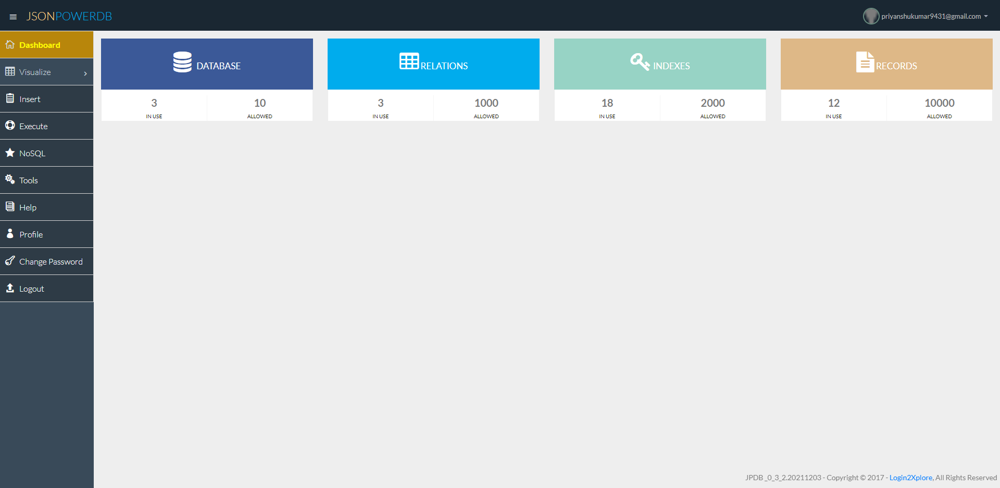
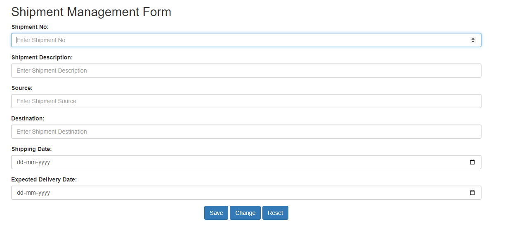

# JSON-Power-DB

JSONPowerDB is a High Performance, Light Weight, Ajax Enabled, Serverless, Simple to Use, Real-time Database. Easy and fast to develop database applications without using any server side programming / scripting or without installing any kind of database.

It is basically a Database Server with Developer friendly REST API services.

JPDB has ready to use API for Json document DB, RDBMS, Key-value DB, GeoSpatial DB and Time Series DB functionality. JPDB supports and advocates for true serverless and pluggable API development.

> Website Link: https://jsonpowerdb.herokuapp.com/

> Documentation Link: https://login2explore.com/jpdb/docs.html#jpdb-command-request

### Benefits Of Using JSONPowerDB:
- It is realtime and simple to use.
- Easy to maintain the reconds.
- Serverless support - fast development - cuts time to market.
- Build using world's fastest indexing engine PowerIndex which gives unlimited data capacity, supporting unlimited indexes, realtime data processing which makes it fast and secure.
- Give developer friendly Webservices API which reduce the developement cost.
- Multiple Security Layers.
- Schema free - easy to maintain
- A single instance - Million Indexes
- Inbuilt support for querying multiple databases.
- It is light weight.
- It is a serverless database so that you don't have to choose an instance size at all.

### Use cases:
- All RDMS use cases.
- All key-value use cases.
- All document use cases.
- Time series/geospatial analytics.
- Real time application for data analytics.
- Live working HTML templates.
- Any software application that needs backend DB. (Dynamic web-apps/Mobile/Desktop Apps)
 

## Project Breakdown :

In this project, I have created Shipment Management Form for hands-on practice on JPDB.

- Createed a form based on Shipment Management. The form should store data in the database. The primary key is 'shipid' and input fields are mentioned.

- There will be three control buttons [Save], [Update] and [Reset] at the bottom of the form. On page load or any control button click, an empty form will be displayed and the cursor will remain at the first input field in the form which will have the primary key in the relation. All other fields and buttons should be disabled at this time.

- User will enter data in the field having primary key and

- - If the primary key value does NOT exist in the database, enable [Save] and [Reset] buttons and move the cursor to the next field and allow the user to enter data in the form.

- - - Check that the data should be valid i.e. no empty fields.

- - - Complete the data entry form and click the [Save] button to store the data in the database and go to step-2.

- - If the primary key value is present in the database, display that data in the form. Enable [Update] and [Reset] buttons and move the cursor to the next' field in the form. Keep the primary key field disabled and allow users to change other form fields.

- - - Check that the data should be valid i.e. no empty fields.

- - - Click on [Update] button to update the data in the database and go to step-2.

- - - Click [Reset] to reset the form as per the step-2.
